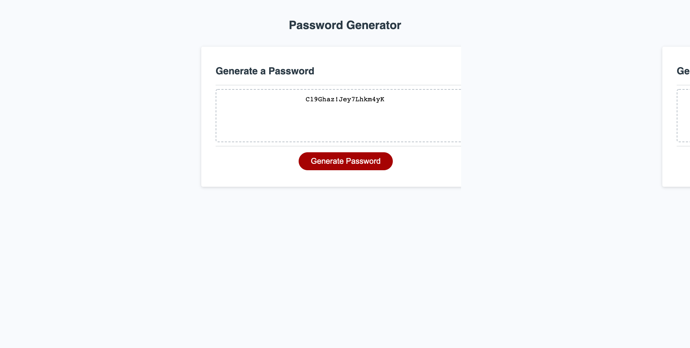

PROJECT: 

    PASSWORD GENERATOR - HOMEWORK 3

    This is a password generator that takes user's choice of length and character selection and output a random string everytime the generate password buttom is clicked. 
    This was accomplished by asking the user for a desired lenght of password and character's choices. The choice of characters was assigned to a new array. The password generator consisted of a loop, running for as many times as the lenght desired. A random number was generated to be the index of the array containing the choice of characters. Next, the character located at the random index location of the array was added into a password variable. Lastly, the choice of characters variable is reset to empty, so the next time the code is run the previous choices are cleared out.

LAYOUT:

    It consists of 

      1. A header.
      2. Body containing a card.
        2.1. A textarea where the password would be displayed.
        2.2. A buttom that once clicked would prompt user to choices.
      

LANGUAGE:

    OBJECT CSS
        The code was written in an object CSS style, in order to consolidate the CSS sheet and make it reusable. 

    JAVASCRIPT
        The JS code is nested in its proper folder.

SCREENSHOT:

LINKS:

[Repo](https://github.com/eugenio18/PasswordGenerator.git)

[Page](https://eugenio18.github.io/PasswordGenerator/)
 

HOW TO CONTRIBUTE

    Any changes made to the files, please log below as follow:
        Example: 05/21 - HTML - changed class on body > nav > ul > li 1
                 05/21 - CSS - added class "c-white"

CHANGES:

01/04 - MAIN - Added full description to README.md

